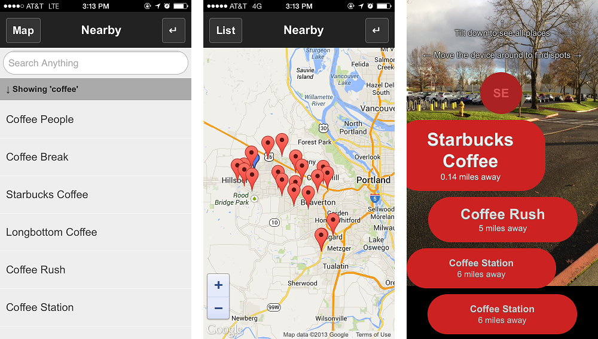

Augmented Reality is a technology to add digital information layer on top of user's view of real world, this article shows how to create a simple augmented reality app with HTML5 using [Intel XDK](http://xdk.intel.com).

The app is developed with HTML5 and uses Cordova* APIs to access device's compass, accelerometer and geolocation information. It also uses Augmented Reality mode intel.xdk API to overlay HTML information on top of a Camera view.

## Designing the Augmented Reality App: 

The app shows distance of cities from the users point of view when the device is pointed in the direction of the city. To accomplish this, the app has 2 modes of operation:

*   Static list of places is shown when the user hold the device flat (table top)
*   Augmented reality mode that overlays a layer with distance of cities from user's point of view when the device is held up vertically and rotated around an axis.

This sample app uses a static list of random cities with latitude and longitude information. This list of cities are loaded as a list and also visualized on a Google* Maps. The augmented reality mode will display camera view and then will add a layer with distance information of cities from users point of view and direction.

Below are screen shots of List view and Augmented Reality mode view of the app:

## Accelerometer to switch UI modes:

The 2 modes of UI is switched by using the Accelerometer API and monitoring the y-axis value. Two DIVs are created for list view and AR mode view, and only one is made visible anytime based on the accelerometer y-axis value. The code below shows how the Cordova* accelerometer API is used to monitor the change UI based on how the phone is held by the user

    // Start checking the accelerometer
    function startAccelerometer() {
        var options = { frequency: 100 };
        watchAccelerometerID = navigator.accelerometer.watchAcceleration(onAccelerometerSuccess, onAccelerometerError, options);
    }

    // onSuccess: Get current accelerometer values
    function onAccelerometerSuccess(acceleration) {
        if(acceleration.y > 7){
            $("#topView").hide();
            $("#arView").fadeIn();
            xdkStartAR();
        } else {
            $("#arView").hide();
            xdkStopAR();
            $("#topView").fadeIn();        
        }
    }

## Calculating the distance and direction from user's point of view:

Next step is to figure out the distance of the city from users point of view, this is calculated by getting the user's current geolocation using Cordova* geolocation API and then using simple math to calculate the distance between 2 points given latitude and longitude. The direction of the cities from user's point of view is refereed to as bearing, which is angle measured in clockwise direction from north line. This is also calculated using simple math. The code below shows how to access geolocation and calculate the distance and bearing:

    // Start watching the geolocation        
    function startGeolocation(){
        var options = { timeout: 30000 };
        watchGeoID = navigator.geolocation.watchPosition(onGeoSuccess, onGeoError, options);
    }

    // onSuccess: Get the current location
    function onGeoSuccess(position) {
        myLat = position.coords.latitude;
        myLng = position.coords.longitude;
        for(var i=0; i< pin.length; i++){
            relativePosition(i);
        }
    }

    function relativePosition(i){
        var pinLat = pin[i].lat;
        var pinLng = pin[i].lng;
        var dLat = (myLat-pinLat)* Math.PI / 180;
        var dLon = (myLng-pinLng)* Math.PI / 180;
        var lat1 = pinLat * Math.PI / 180;
        var lat2 = myLat * Math.PI / 180;
        var y = Math.sin(dLon) * Math.cos(lat2);
        var x = Math.cos(lat1)*Math.sin(lat2) - Math.sin(lat1)*Math.cos(lat2)*Math.cos(dLon);
        bearing = Math.atan2(y, x) * 180 / Math.PI;
        bearing = bearing + 180;
        pin[i]['bearing'] = bearing;

        var a = Math.sin(dLat/2) * Math.sin(dLat/2) + Math.sin(dLon/2) * Math.sin(dLon/2) * Math.cos(lat1) * Math.cos(lat2); 
        var c = 2 * Math.atan2(Math.sqrt(a), Math.sqrt(1-a)); 
        distance = 3958.76  * c;
        pin[i]['distance'] = distance;
    }

## Displaying POI that are in user's point of view:

Once we have the bearing information for each city, we have to then display this information only if the user's device is pointing in the direction of the city. The angle at which the user's device is pointed can be figured out by accessing the device's compass using the Cordova* Compass API. Finally each city's bearing value is continuously compared to the device's compass value and the city is displayed if bearing offset is within few degrees of the compass value. The code below shows how bearing is compared with compass value to manipulate the UI DOM to display the cities based on whether it is in the same direction of user's point of view:

    

    
    // Start watching the compass
    function startCompass() {
    var options = { frequency: 100 };
    watchCompassID = navigator.compass.watchHeading(onCompassSuccess, onCompassError, options);
    }
    
    // onSuccess: Get the current heading
    function onCompassSuccess(heading) {
    var degree = heading.magneticHeading;
    if($("#arView").is(":visible")){
    calculateDirection(degree);
    }
    }
    
    // calculate direction of points and display
    function calculateDirection(degree){
    for(var i=0;i<pin.length;i++){
    if(Math.abs(pin[i].bearing - degree) <= 20){
    $("#spot").append('
'+pin[i].name+'
'+ away +' miles away

');
    }
    }
    }
    
    

## Camera overlay for Augmented reality mode view:

Final step is to add a camera view and overlay HTML elements on it. This cannot be accomplished with use HTML5, this sample used intel.xdk JavaScript bridge API to add augmented reality mode. The code below shows how ARMode is enabled and disabled:

    // start augmented reality mode
    intel.xdk.display.startAR();

    // stop augmented reality mode
    intel.xdk.display.stopAR();

## Extending the sample app for real world apps:

This sample code can be modified to load real data points from an API like Foursquare* to search and visualize real places like restaurants, bars, parks or other places. The full code for searching places using foursquare and visualizing as augmented reality is available on [github](https://github.com/krisrak/html5-augmented-reality-app).

